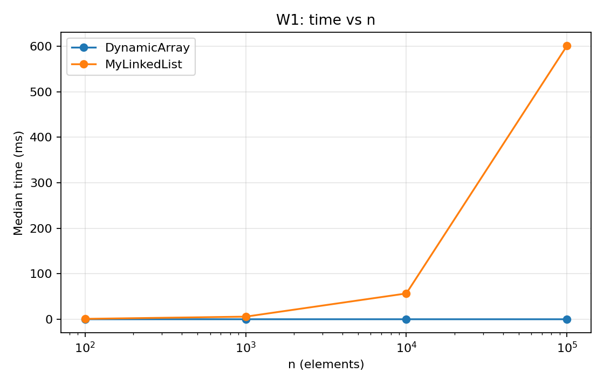
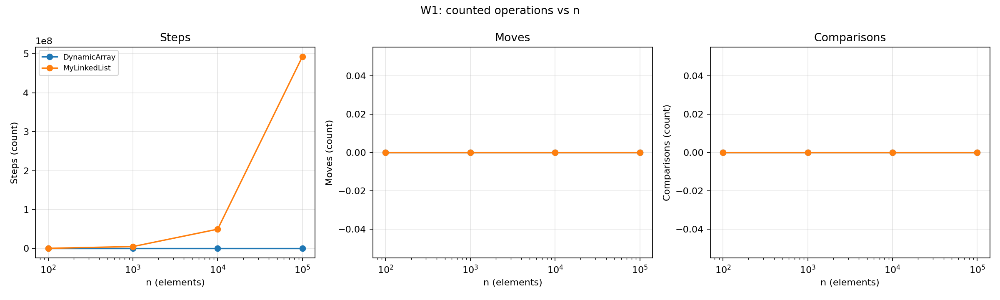
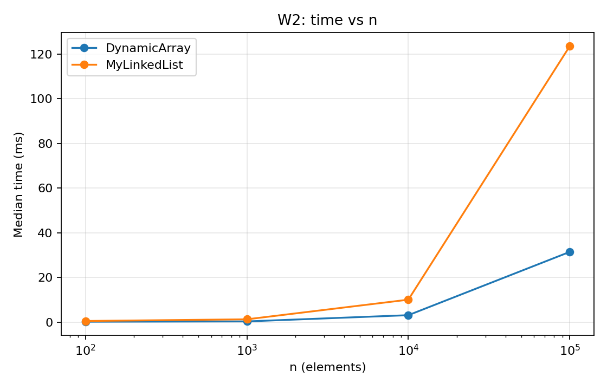
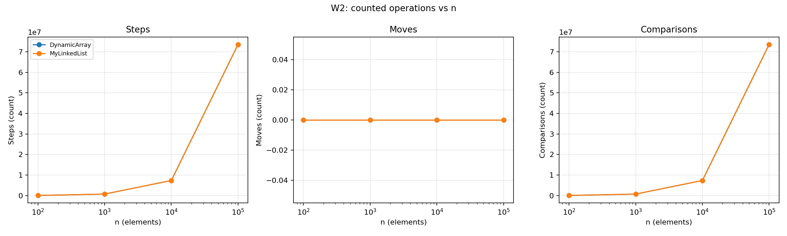
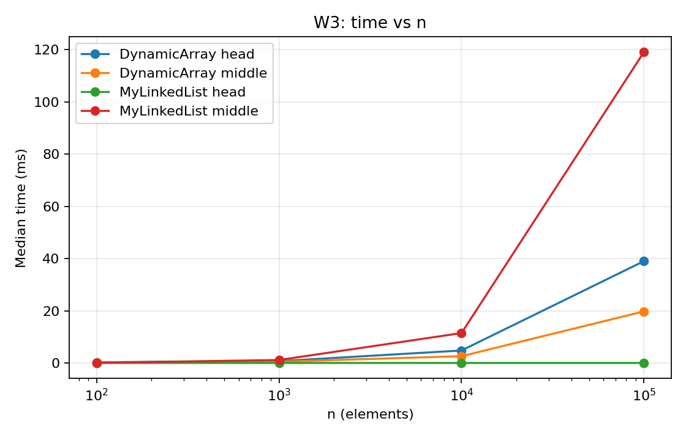
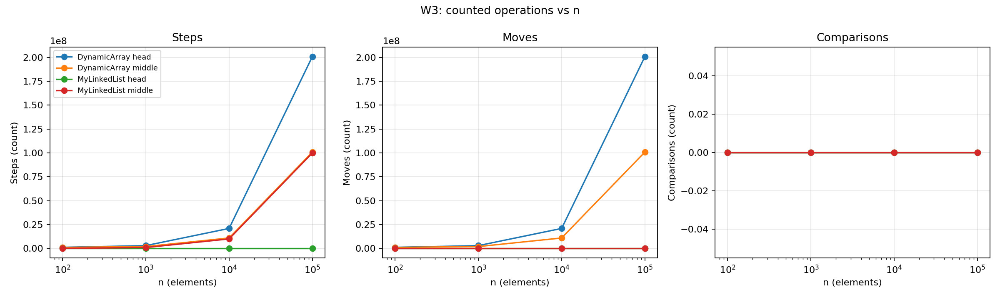
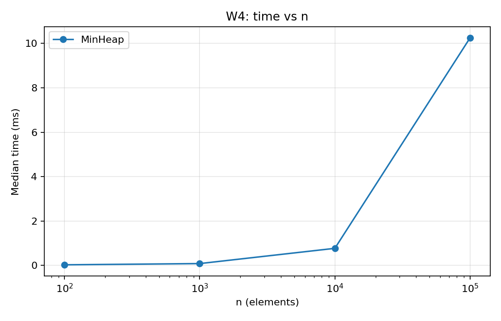
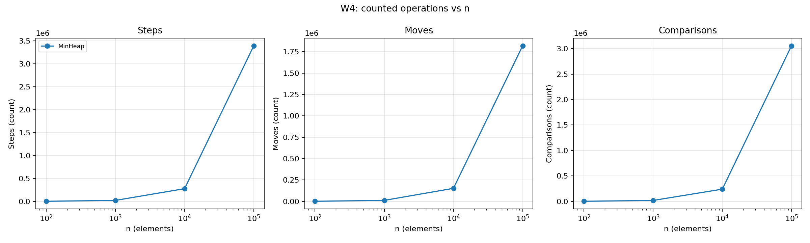

# Assignment 2 Report: In-Memory Workload Engine

## Implementation and measurement

`DynamicArray` stores primitive `int` values in an array that doubles when full. `MyLinkedList` uses singly linked nodes and keeps both head and tail pointers. `MinHeap` stores primitive `int` values in a binary heap array. `DynamicArray` and `MyLinkedList` implement the same `IntSequence` interface. The Java implementations use no Java collection classes.

For each `n` in 100, 1,000, 10,000, and 100,000, the input is generated by `new Random(42)`. W1 makes 10,000 random `get(index)` calls. W2 makes 1,000 `contains(x)` calls, alternating values drawn from the input with guaranteed absent negative values. W3 makes 1,000 insertions and 1,000 removals at either the head or the fixed index `n / 2`. W4 inserts all `n` values into the heap, then extracts all values and checks that they are non-decreasing. Each case has 10 discarded warm-up runs and 5 measured runs; the CSV records the median time. Steps, moves, and comparisons are counted inside the structure methods. W1-W3 counters start after filling; W4 counters include both insertion and extraction.

## Complexity

Here `n` is the size before an operation. "Average" for indexed methods assumes a uniformly chosen valid index. For search it assumes a uniformly chosen matching position or a miss. The heap insertion average assumes independent random keys; without that assumption, use the worst-case bound. Array growth and heap growth copy the old array, so their single-operation worst case is `Θ(n)`. The array and heap each use `Θ(n)` total storage, while the list uses `Θ(n)` nodes. Apart from storage already owned by a structure, each method uses `Θ(1)` local space; growth temporarily allocates another `Θ(n)` array.

| Structure | Operation | Best | Average | Worst | Reason |
|---|---|---|---|---|---|
| DynamicArray | `add(x)` | Θ(1) | Θ(1) amortized | Θ(n) | Appending is one write except when capacity doubles and all values are copied. |
| DynamicArray | `add(index,x)` | Θ(1) | Θ(n) | Θ(n) | Insertion shifts the suffix and may also resize. |
| DynamicArray | `remove(index)` | Θ(1) | Θ(n) | Θ(n) | Removing the last item shifts none; other positions shift the suffix. |
| DynamicArray | `get(index)` | Θ(1) | Θ(1) | Θ(1) | Direct array indexing needs one cell read. |
| DynamicArray | `contains(x)` | Θ(1) | Θ(n) | Θ(n) | Linear scan stops at the first match or the end. |
| MyLinkedList | `add(x)` | Θ(1) | Θ(1) | Θ(1) | A tail pointer permits constant-time append. |
| MyLinkedList | `add(index,x)` | Θ(1) | Θ(n) | Θ(n) | Head and tail are direct; a middle insertion traverses to its predecessor. |
| MyLinkedList | `remove(index)` | Θ(1) | Θ(n) | Θ(n) | Removing the head is direct; other positions require traversal. |
| MyLinkedList | `get(index)` | Θ(1) | Θ(n) | Θ(n) | Reaching index `i` follows `i` next pointers. |
| MyLinkedList | `contains(x)` | Θ(1) | Θ(n) | Θ(n) | Nodes are checked in order until a match or the end. |
| MinHeap | `insert(x)` | Θ(1) | Θ(1) expected amortized | Θ(n) | Random keys usually rise only a few levels; a resize copies `n` values. Without resize, the worst rise is Θ(log n). |
| MinHeap | `peekMin()` | Θ(1) | Θ(1) | Θ(1) | The minimum is at array index zero. |
| MinHeap | `extractMin()` | Θ(1) | Θ(log n) | Θ(log n) | The replacement may descend from the root to a leaf. |

## Loop invariants

### 1. `DynamicArray.contains(value)`

**Invariant.** Before iteration `i`, none of `data[0]` through `data[i - 1]` equals `value`.

**Initialization.** At `i = 0`, the checked prefix is empty, so the statement is true.

**Maintenance.** The method compares `data[i]` with `value`. If they are equal, returning `true` is correct. Otherwise the checked prefix grows by one non-matching item, so the invariant holds before the next iteration.

**Termination.** If the loop reaches `i = size`, the invariant says every stored value was checked and none matched; returning `false` is correct.

**Conclusion.** The method returns `true` exactly when it encounters a matching element, and otherwise returns `false` after checking all elements.

### 2. Bubble-down loop in `MinHeap.extractMin()`

**Invariant.** Before each iteration, `value` holds the former last element, the active array positions outside the current `index` satisfy the min-heap order, and only the placement of `value` at `index` may break that order. The path above `index` has already been repaired.

**Initialization.** After removing the last element and saving it in `value`, both subtrees under the root still satisfy the heap order. Only the root position needs a replacement.

**Maintenance.** The loop reads the smaller child. If `value` is larger, it moves that child up. The promoted child is no larger than its sibling and is no smaller than its already repaired parent, so the heap order above the new `index` holds. Only the new hole may still need repair.

**Termination.** The loop ends when there is no child or `value` is no larger than the smaller child. Writing `value` at `index` then satisfies the heap order there and everywhere else.

**Conclusion.** The original root was the minimum, so the returned value is correct. The invariant and stopping condition show that the remaining array is a valid min-heap.

## Results and plots

The full measurements are in [`results/results.csv`](results/results.csv). Each workload has a time chart and a three-panel chart for steps, moves, and comparisons:

| Workload | Time | Counted operations |
|---|---|---|
| W1 random access |  |  |
| W2 search |  |  |
| W3 insert and remove |  |  |
| W4 priority processing |  |  |

At `n = 100,000`, the median times from this run were:

| Workload | DynamicArray | MyLinkedList | MinHeap |
|---|---:|---:|---:|
| W1 random access | 0.0427 ms | 600.9553 ms | - |
| W2 search | 31.4705 ms | 123.5835 ms | - |
| W3 head | 38.9931 ms | 0.0096 ms | - |
| W3 middle | 19.7503 ms | 119.0536 ms | - |
| W4 priority processing | - | - | 10.2454 ms |

## Discussion

At `n = 100,000`, W1 records 10,000 array steps but about 493 million list steps because each list access walks from the head. The array keeps adjacent `int` values together, so many values fit in nearby CPU cache lines. The list instead follows pointers to separate node objects, which often requires waiting for a different cache line. This explains why array access is also faster for a simple sequential pass: spatial locality helps even if both passes take Θ(n) operations. In W2, both structures make about 73.6 million value comparisons at `n = 100,000`, yet the list takes longer because following node pointers is more expensive than reading consecutive array cells. Each list node also has an object header and a pointer, increasing memory use and work for the garbage collector. W3 head operations favor the list because changing the head uses a constant number of pointer updates while the array shifts many values. W3 middle operations at `n = 100,000` favor the array in time even though it shifts about 101 million values, because contiguous copying is fast and the list must traverse roughly 100 million links. The list is therefore a good choice when repeated head changes dominate and direct indexing is rare. The array is a good choice for frequent indexing, scanning, and compact storage. The heap is the right choice when the workload repeatedly needs the smallest pending job, since `peekMin` is Θ(1) and extraction is Θ(log n). W4's extracted sequence was checked to be non-decreasing in every run. Very short cases have timer and JIT noise, so the operation counts and larger `n` values give a more reliable view of growth than isolated small timings.
